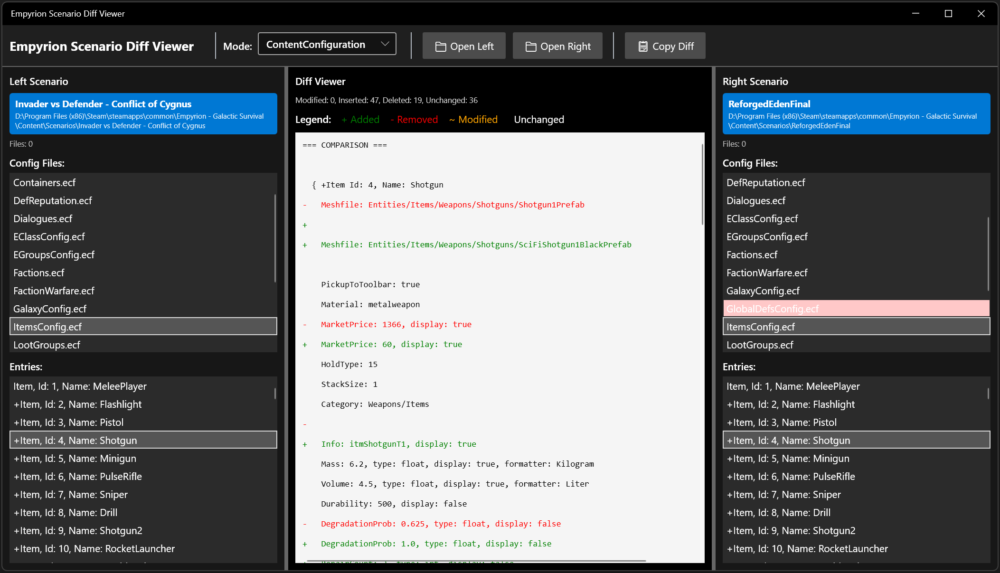

# Empyrion Scenario Diff Viewer

A Windows desktop app for comparing two Empyrion scenario folders side-by-side. Useful when you want to see what changed between your scenario and a reference like Invader vs Defender or Reforged Eden—without manually diffing files one at a time in Beyond Compare.

## Running the App

Download the latest release build and extract the zip to a folder of your choice.

1. **Requirements**: Windows 10 or later, plus the [.NET 9 Desktop Runtime](https://dotnet.microsoft.com/download/dotnet/9.0) if the build is not self-contained.
2. **Launch**: Double-click `EmpyrionScenarioDiffViewer.exe`.

## Quick Start

1. **Select a mode** from the dropdown (modes are sorted alphabetically).
2. **Open Left** and **Open Right** — select each scenario's **root folder** (e.g. `...\Scenarios\Reforged Eden 2\`), not a subfolder like `Content` or `Playfields`.
3. **Pick a file or folder** from the top list on either side. The other side auto-selects the matching item.
4. **Pick an entry** from the bottom list to view a diff in the center panel.
5. **Copy Diff** to copy results to the clipboard.

### Reading the UI

- **Pink background** — file, folder, or entry exists on only one side.
- **Green / red / orange** in the diff panel — added, removed, or changed lines.
- **Left and right lists stay in sync** when you select matching files and entries.

## Comparison Modes

Each mode looks in a specific path under the scenario root you open.

| Mode | Looks in | What you compare |
|------|----------|------------------|
| **Content/Configuration** | `Content/Configuration/` | `.ecf` config blocks and `.csv` dialogue rows (e.g. `Dialogues.csv`) |
| **Extras/PDA** | `Extras/PDA/` | PDA mission chapters (YAML) and string rows (CSV) |
| **Extras/Localization** | `Extras/Localization.csv` | Localization strings by KEY |
| **Playfields** | `Playfields/*/` | YAML files inside each playfield folder |
| **Prefabs** | `Prefabs/` and `Templates/` | EPB blueprint metadata (not raw binary) |
| **RandomPresets** | `RandomPresets/` | Random generation YAML (solar systems, sector rules, etc.) |
| **Sectors** | `Sectors/Sectors.yaml` | Individual galaxy sectors, matched by coordinates |
| **SharedData/Content** | `SharedData/Content/**` | Shared asset folders and files (manifests, configs, etc.) |

### Notes

- **Content/Configuration** — ECF entries are individual blocks (`Block Id: 1, Name: Stone`). CSV files are one entry per KEY row.
- **Extras/PDA** — YAML: one entry per chapter. CSV: one entry per KEY.
- **Extras/Localization** — One entry per KEY; English text is shown as the display name when present.
- **Playfields** — Top list = playfield folder name. Bottom list = YAML files in that folder.
- **Prefabs** — Compares parsed blueprint metadata (dimensions, block counts), not the full EPB binary.
- **RandomPresets** — Entry format is auto-detected per file (SolarSystems, sector rules, or whole file).
- **Sectors** — One entry per sector under `Sectors:`; matched by galaxy coordinates.
- **SharedData/Content** — Top list = relative folders (`(root)`, `Bundles`, `Extras/LoadingScreenshots`, …). Bottom list = files in that folder. Text files are diffed; unreadable/binary files show a placeholder message.

## License

This project is provided as-is for use with Empyrion - Galactic Survival.

Built for the Empyrion Galactic Survival community.
